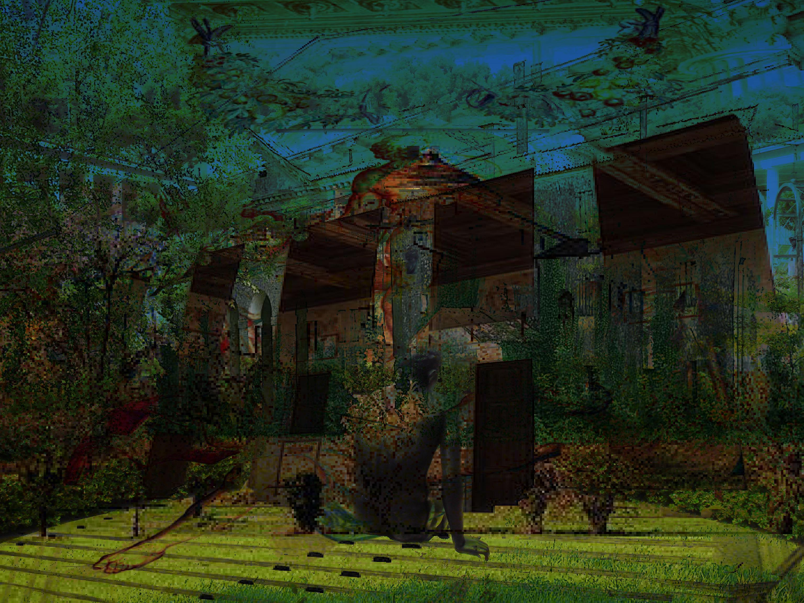

# Crawler
## Part of the Thesis Research by Sergey Pigach and Lucas Bucknavage

A web-crawler type application that navigates through Wikipedia articles via the in-text links and produces a graphical output. The execution of the script begins with two requests: "Topic" and "Number of Network Hops." "Topic" refers to the starting Wikipedia entry (e.g. "Sagrada Familia"). "Network Hops" refers to the number of times the crawler will jump from one page to the next (most of our tests were limited to 5, but you can choose any number). 

After navigating to the original page the Crawler extracts all the in-text links from that Wikipedia article. Then it connects to the WordNet database and compares all the links with the original request for path similarity. The link with the highest score is the one the Crawler navigates to next. As it transitions through articles, the script grabs the largest image from each page and collages them all together at the end in order to present a graphic representation of its path. 

## Pre-requisites:
Tested on Fedora 24 and 25, but should run on any Unix system. Uses Python 2.7 - a lot of the libraries used are not available on Python 3. Don't forget to change the paths to the folders to match your system:
- ...Desktop/dump
- ...Desktop/selected

Required libraries:
- json
- extraction
- requests
- urllib
- urllib2
- re
- terminaltables
- nltk
- Pillow
- shutil

#Other examples:
- Altes Museum:

- Villa Savoye:

- Pablo Picasso:

